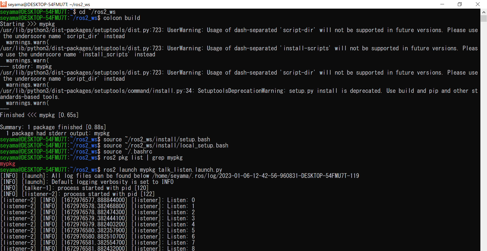

## このリポジトリについて 
 

* これはROS2のパッケージです。
* このパッケージは、launchファイルを使用して、複数のノード（今回ではtalker.pyとlistener.py）を一度に立ち上げるパッケージです。

## ノードとトピックの関係性について
* このパッケージではtalkerというノードから/countupというトピックを通じて、listenerというノードでメッセージを受け取っている。

## 使用方法

 　↑使用時のターミナル  
* 1.パッケージをビルドする。（ビルドの仕方は上図より）
* 2.launchファイルを実行する。（実行方法は上図より）

## 必要なソフトウェア

* Python
* ROS2 (Version:Humble Hawksbill)

## テスト環境

* Ubuntu22.04

## ライセンス
* このソフトウェアパッケージは，3条項BSDライセンスの下，再頒布および使用が許可されます。
   © 2022 Gakuto Seyama
